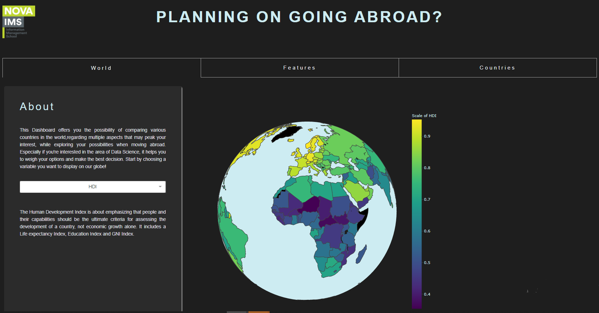

# Where to go next as a Data Scientist?

This repository contains an interactive Dashboard, created with Dash by Plotly, which can help aspiring Data Scientists to choose a country to relocate to, given a fair number of factors. This topic seemed up to date and especially relevant as first year Data Science Master’s Students: Where to go next. Either as a professional internship or for an actual job, the choice and decision on a country, after the decision of moving abroad, can be quite challenging; and this is where this Dashboard comes in handy. 

The following variables were collected ans visualized in the Dashboard:

1. __Basic Human Needs__ - Index that combines multiple factors regarding Nutrition and Basic Medical Care, Water
and Sanitation, Shelter and Personal Safety. (Measured in percentage)  
2. __Data Scientists Salary__ - refers to the average gross annual Compensation of someone working in the area of
Data Science. (Measured in US dollars) 
3. __Foundations of Wellbeing Index__- Index that's mainly focused on the Access to Basic Knowledge, Access to
Information and Communications, Health and Wellness and Environmental Quality. (Measured in percentage) 
4. __Human Development Index__ - about emphasizing that people and their capabilities should be the ultimate
criteria for assessing the development of a country, not economic growth alone. It includes a Life expectancy
Index, and Education Index and GNI Index. (Measured in 0-1 scale) 
5. __Opportunity Index__ - Index that includes Personal Rights, Personal Freedom and Choice, Inclusiveness and
Access to Advanced Education. (Measured in percentage) 
6. __Social Progress Index__ – Index that joins the Basic Human Needs, Foundations of Wellbeing and Opportunity
Indices into one. (Measured in percentage) 
7. __Temperature__ - the average minimal(mean) temperature and maximal(mean) temperature of a country
(Measured in Celsius) 
8. __Wage Index__ - Index that refers to the unadjusted Gender Pay Gap (GPG) and represents the difference
between average gross hourly earnings of male paid employees and of female paid employees as a percentage
of average gross hourly earnings of male paid employees. (Measured in percentage) 
9. __Cost of living Index__ – Index regarding the overall estimation of living in a country, including every necessary
expense one can have. (Measured in percentage) 
10. __Groceries Index__ - Index regarding the average princes for groceries in a country 
11. __Rent Index__ - refers to the average cost of renting an apartment in a country. (Measured in percentage)
• The measurement of the last three indexes are relative to New York, which means that all indices
regarding New York are equal to 100, and cities that are cheaper or more expensive, are
accordingly higher and lower than 100, respectively 
12. __Happiness Score__ - by the “The World Happiness Report” is an annual publication of the United Nations
Sustainable Development Solutions Network. It contains articles, and rankings of national happiness based on
respondent ratings of their own lives, which the report also correlates with various life factors. (Measured in
percentage) 

  

## Visualization and interaction choices
As an inspiration for this work, we took in account the method of showing data used by the World Data Bank, where
in one single visualization they summarize one variables information, from multiple places in the world and in
different year ranges.
As such, our goal was to do something similar: visualizations that allow us to summarize important descriptive
variables of the quality of living (as a data scientist) in different places in the world, answering the question that we
have in our heads at the moment: “Where to go abroad?”. All the visualizations should lead us to the best decision,
taking in account witch variables are most important for each user.
We based our visualizations choices based on the knowledge of both theoretical and practical classes, the
recommend course book, the Python Graph Gallery and the papers “Data visualization 101: how to design charts
and graphs” and “What Makes a Visualization Memorable?”.
Our Dashboard includes three different tabs, where each one has a specific purpose.

### Tab 1: World
The initial Tab that opens automatically when one enters our Dashboard is focused on a general description of the
idea and the possibilities that we offer. This tab offers a great overview for the user, to peak a general interest on
which variables we’re working on, and to compare values for the same variable on various continents. Additionally,
by selecting a variable, beneath the selection Dropdown there will be displayed a small description of the variable,
similar to the definitions in section 2.
World Globe Heatmap
On the right side we implemented a world globe heatmap, where the user can decide on a variable to display. After
having selected a variable, the correspondent value for the most recent year will be displayed in each country that
has a record, in a corresponding colour, that can be interpreted with the colour scale legend to the right side of the
visualization. 

   

  _Screenshot of this tab:_  

  
### Tab 2: Features
After having gained a general overview of the variables and countries that can be compared using our Dashboard,
the second Tab has the sole purpose of directly comparing several countries on the same feature.
Bar Chart for Top 5 countries for chosen variable
Thus, we decided on displaying a bar chart that visualizes the top 5 countries for a variable that the user, once again,
can decide on. As a result, this offers the possibility of identifying which countries outshine others regarding the
variables that the user prioritizes. (Using the most effective channel: position) 

  
### Tab 3: Countries
Finally, after the user has elected the countries which seem most appealing for his or her purpose, our final and
most information-revealing tab serves to visualize all the features for the respective countries. Thus, we included3
several charts next to the global indicators of World Happiness Score, World cost of Living, and World Annual Data
Scientist’s Salary, to facilitate the comparison of the values of a certain county with the World average. We
considered these features at the most essential combination that includes various perspectives and priorities.

